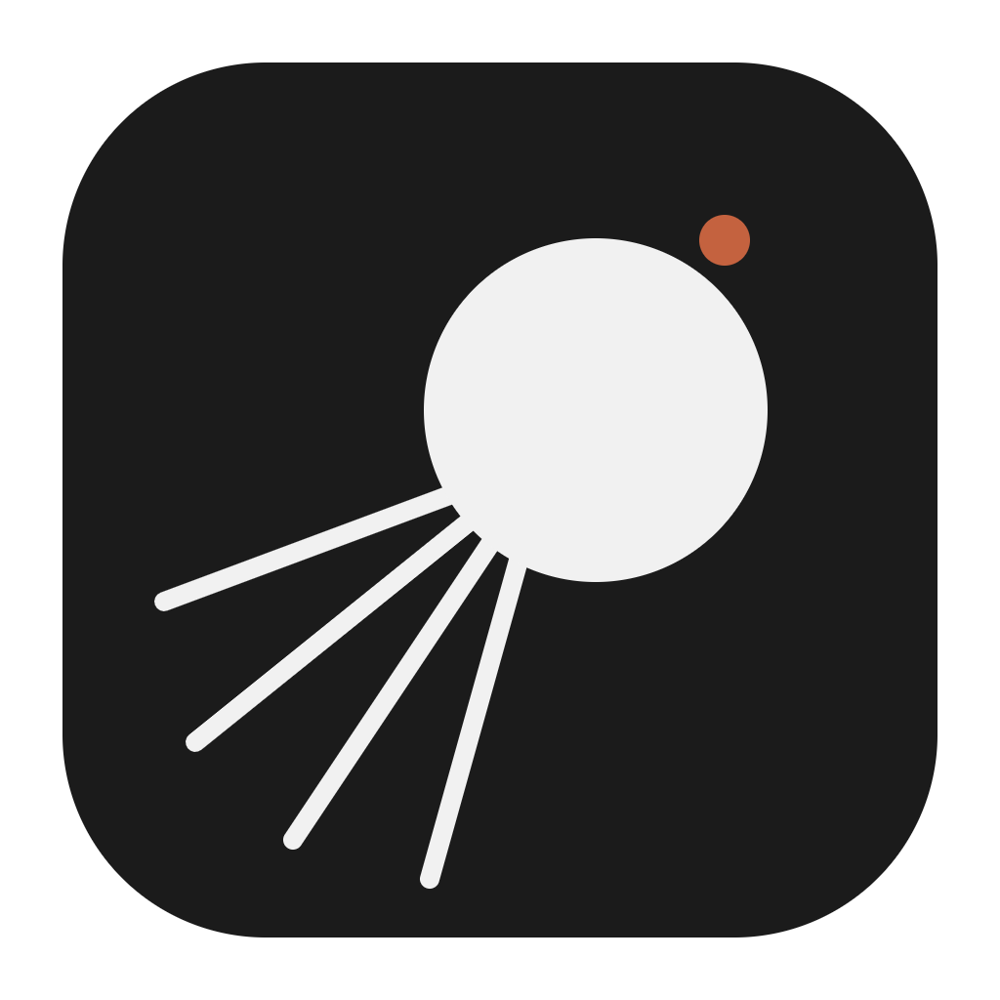

# Sputnik

A minimalist desktop music player for Windows, macOS and Linux.

- Drop songs or whole folders, or add them from the menu. Reorder by dragging (or
  Alt+↑/↓), shuffle, repeat the list or one song.
- Save playlists, rename them in place, and import or export them as M3U8 (they open
  in VLC, foobar2000 and most players).
- Light and dark themes, plus a calm tint taken from the cover of the song that is
  playing. Text contrast is guaranteed (WCAG AA) for any cover.
- Keyboard shortcuts, media keys and the OS media controls. Spanish and English.
- Scrobbling to Last.fm (Settings → Connect to Last.fm). Listens made offline are
  kept and sent later.
- Your queue, volume and settings are restored on the next start.

Plays MP3, AAC/M4A, FLAC, WAV, Ogg Vorbis and Opus (WMA and ALAC are not supported).

## Keyboard shortcuts

| Key                | Action                       |
| ------------------ | ---------------------------- |
| Space              | Play / pause                 |
| ← / →              | Seek 5 seconds               |
| ↑ / ↓              | Move the selection           |
| Enter              | Play the selected song       |
| Delete / Backspace | Remove the selected song     |
| Alt + ↑ / ↓        | Move the selected song       |
| M / S / R          | Mute / shuffle / repeat mode |
| Ctrl/Cmd + O       | Add songs                    |
| Ctrl/Cmd + S       | Save the playlist            |
| Ctrl/Cmd + E       | Export the playlist          |

## Download

Get the installer for your system from the
[latest release](https://github.com/bonavida/sputnik/releases/latest):

| System                | File                                          |
| --------------------- | --------------------------------------------- |
| Windows 10/11 (x64)   | `Sputnik-<version>-setup.exe`                 |
| macOS (Apple Silicon) | `Sputnik-<version>-arm64.dmg`                 |
| macOS (Intel)         | `Sputnik-<version>-x64.dmg`                   |
| Linux                 | `Sputnik-<version>-x86_64.AppImage` or `.deb` |

### First launch: the installers are not signed

Signing needs paid certificates from Microsoft and Apple, so the system warns the
first time you open Sputnik. The app is safe to run; this is how to get past the
warning:

- **Windows**: SmartScreen shows "Windows protected your PC". Click **More info**,
  then **Run anyway**.
- **macOS**: open the `.dmg` and drag Sputnik to Applications. The first time,
  right-click (or Control-click) Sputnik in Applications and choose **Open**, then
  **Open** again. If macOS says the app "is damaged and can't be opened", run this
  once in Terminal and open it again:

  ```bash
  xattr -cr /Applications/Sputnik.app
  ```

- **Linux**: make the AppImage executable (`chmod +x Sputnik-*.AppImage`) or install
  the `.deb` with `sudo apt install ./Sputnik-*.deb`.

Size on Windows x64 (Electron 44):

|                                             | Installer | Installed |
| ------------------------------------------- | --------- | --------- |
| Sputnik                                     | 86.4 MB   | 296 MB    |
| Same app, default electron-builder settings | 111.5 MB  | 369 MB    |

Almost all of it is Chromium: the app itself is under 1 MB.

## Development

Requirements: Node.js 24 and pnpm 10.

```bash
pnpm install
pnpm dev          # Electron with hot reload
pnpm dev:web      # UI only, in the browser, with demo data
pnpm test         # unit and integration tests
pnpm dist         # installer for the current OS, in release/
```

To build with Last.fm scrobbling, copy `.env.example` to `.env.local` and fill in
the key and secret of a [Last.fm API account](https://www.last.fm/api/account/create).
Without them everything works and the Last.fm option is hidden.

Built with Electron, React 19 (with React Compiler), TypeScript, Vite, Tailwind CSS,
Zustand, dnd-kit and music-metadata. Tested with Vitest and Testing Library.

Architecture, conventions and procedures are in [AGENTS.md](AGENTS.md).

## License

[MIT](LICENSE)
